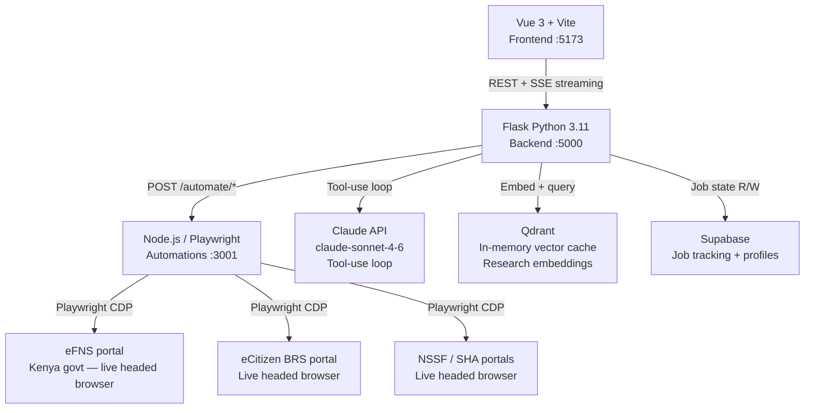
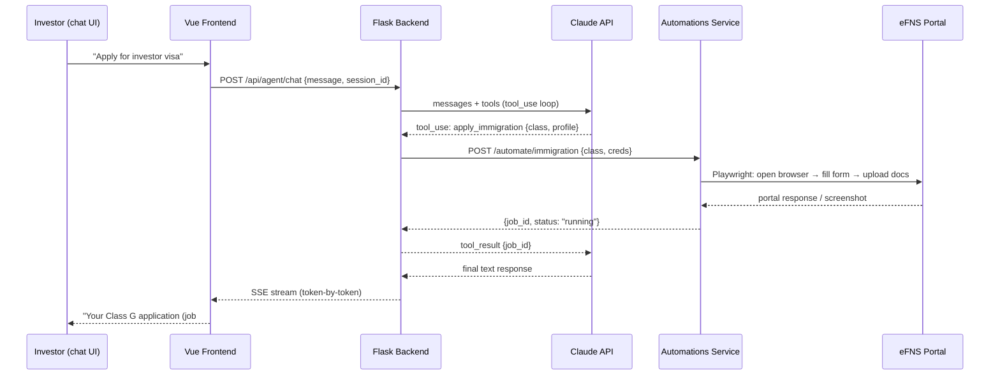

# Meridian Global Investor OS

> **One AI platform to Land, Launch, and Live as a foreign direct investor in Kenya — and beyond.**

   

Meridian collapses a 6–12-week, multi-portal investor journey into a single AI-orchestrated session. A Claude-powered agentic harness plans the journey; a live Playwright automation layer *executes* it against real government portals — eFNS immigration, eCitizen BRS, NSSF, SHA — on screen, in the browser.

Kenya is the flagship market. Every country is a JSON adapter, so the same OS scales globally.

---

## Table of Contents

- [Investor Journey](#investor-journey)
- [Architecture](#architecture)
- [Agent Sequence](#agent-sequence)
- [Features](#features)
- [Quick Start](#quick-start)
- [API Reference](#api-reference)
- [One-Click Deploy](#one-click-deploy)
- [Screenshots](#screenshots)
- [Roadmap](#roadmap)
- [Team](#team)
- [License](#license)

---

## Investor Journey

```mermaid
flowchart LR
    A([Investor arrives]) --> B

    subgraph LAND ["✈ LAND"]
        B[Flight search\nJFK / LHR / DXB / JNB → NBO / MBA]
        B --> C[eTA application\nPlaywright → Kenya eTA portal]
        C --> D[Immigration class advisor\nClass G / D / R / N / SP / eTA]
        D --> E[eFNS filing\nHeaded Playwright automation]
    end

    subgraph LAUNCH ["🚀 LAUNCH"]
        F[BRS company registration\neCitizen portal]
        F --> G[Sector + county licensing roadmap\nAgritech / Fintech / Manufacturing…]
        G --> H[NSSF + SHA employer registration]
        H --> I[JD + hiring generator\nKenya-compliant JDs + salary bands]
        I --> J[Agent marketplace\nLawyers / accountants / fixers]
    end

    subgraph LIVE ["🌍 LIVE"]
        K[KWS park concierge\n6 national parks]
        K --> L[Booking + emailed invoice\nResend / local HTML]
        L --> M([Investor operating in Kenya])
    end

    E --> F
    J --> K
```



---

## Architecture



---

## Agent Sequence



---

## Features

| Phase | Feature | Status |
|-------|---------|--------|
| **LAND** | Flight search — JFK / LHR / DXB / JNB → NBO / MBA | ✅ Live |
| **LAND** | eTA application — Playwright on Kenya eTA portal | ✅ Live |
| **LAND** | Immigration class advisor — G / D / R / N / SP / eTA | ✅ Live |
| **LAND** | Generated eligibility proposals with itemized fees | ✅ Live |
| **LAND** | Automated eFNS permit filing (headed, stops before submit) | ✅ Live |
| **LAUNCH** | BRS company registration automation | ✅ Live |
| **LAUNCH** | Sector × county licensing roadmap (6 sectors, 47 counties) | ✅ Live |
| **LAUNCH** | NSSF employer registration + Tesseract captcha solving | ✅ Live |
| **LAUNCH** | SHA employer registration automation | ✅ Live |
| **LAUNCH** | JD + hiring generator (Kenya-compliant, salary bands) | ✅ Live |
| **LAUNCH** | Human agent marketplace (vetted lawyers / accountants) | ✅ Live |
| **LIVE** | KWS national park concierge (6 parks, KES pricing) | ✅ Live |
| **LIVE** | Booking + emailed invoice (Resend / local HTML fallback) | ✅ Live |
| **CROSS** | Claude agentic harness — 10 tools, prompt caching | ✅ Live |
| **CROSS** | Country-adapter pattern (Kenya = `countries/KE.json`) | ✅ Live |
| **CROSS** | MiroFish-style market-gap researcher + go/no-go verdict | ✅ Live |
| **CROSS** | Qdrant in-memory research cache | ✅ Live |
| **CROSS** | Supabase job tracking | 🔄 In progress |
| **CROSS** | Investor profile wizard + dashboard | 🔄 In progress |
| **CROSS** | One-click Railway deploy | 🔄 In progress |
| **GLOBAL** | Rwanda / Ghana country adapter | 🔜 Next |
| **GLOBAL** | Realtime voice concierge (VAPI / Kesi) | 🔜 Next |

---

## Quick Start

**Prerequisites**: Python 3.11+, Node.js 18+, an Anthropic API key.

### Step 1 — Clone

```bash
git clone https://github.com/jepale/meridian-investor-platform.git
cd meridian-investor-platform
```

### Step 2 — Configure environment

```bash
cp .env.example .env
# Open .env and set:
#   ANTHROPIC_API_KEY=sk-ant-...
#   SUPABASE_URL=...          (optional — defaults to in-memory job store)
#   SUPABASE_KEY=...
#   RESEND_API_KEY=...        (optional — invoices save locally if absent)
#   EFNS_EMAIL=...            (portal credentials for automation demo)
#   EFNS_PASSWORD=...
```

### Step 3 — Run all three services

```bash
# Terminal 1 — Flask backend + Claude harness
python run_local.py

# Terminal 2 — Node.js Playwright automations microservice
node automations/server.mjs

# Terminal 3 — Vue 3 frontend
cd frontend && npm install && npm run dev
```

Open [http://localhost:5173](http://localhost:5173) and start the investor journey.

---

## API Reference

All endpoints accept and return JSON. The agent chat endpoint streams via SSE when `Accept: text/event-stream`.

### `POST /api/agent/chat`

Start or continue a conversation with the Claude agentic harness.

```json
// Request
{
  "message": "I want to register a fintech company in Nairobi",
  "session_id": "inv_abc123",   // optional — creates new session if omitted
  "investor_profile": {}        // optional — merged into session state
}

// Response (SSE stream)
data: {"type": "text", "content": "Great — let me build your licensing roadmap..."}
data: {"type": "tool_call", "name": "build_licensing_roadmap", "input": {...}}
data: {"type": "tool_result", "name": "build_licensing_roadmap", "output": {...}}
data: {"type": "done", "session_id": "inv_abc123"}
```

### `POST /api/invest/research`

Run a MiroFish market-gap research query for a given sector and county.

```json
// Request
{ "sector": "agritech", "county": "Nakuru", "depth": "full" }

// Response
{
  "verdict": "GO",
  "confidence": 0.87,
  "gap_summary": "...",
  "market_size_usd": 420000000,
  "key_risks": ["..."],
  "cached": false
}
```

### `POST /api/flights/search`

Search flights into NBO (Nairobi JKIA) or MBA (Mombasa).

```json
// Request
{ "origin": "JFK", "destination": "NBO", "date": "2026-09-15", "type": "one_way" }

// Response
{
  "offers": [
    { "carrier": "Kenya Airways", "stops": 1, "duration_h": 16.5, "price_usd": 720 }
  ],
  "source": "live"   // or "curated"
}
```

### `GET /api/agent/session/:id`

Retrieve session state and tool call history for a given session.

```json
// Response
{
  "session_id": "inv_abc123",
  "investor_profile": { "nationality": "US", "sector": "agritech", "capital_usd": 250000 },
  "phase": "LAUNCH",
  "tool_calls": [...],
  "created_at": "2026-07-25T09:00:00Z"
}
```

---

## One-Click Deploy

Meridian ships as three Railway services (backend, automations, frontend) with a shared environment.

[](https://railway.app/template/meridian-investor-os)

```bash
# Or deploy manually via the helper script:
bash scripts/deploy_railway.sh
```

The script provisions three Railway services, links them, and prompts for the required environment variables. See `scripts/deploy_railway.sh` for details.

---

## Screenshots

> Add screenshots here — place images in `./assets/screenshots/` and update the paths below.

| View | Screenshot |
|------|------------|
| Concierge chat (landing) |  |
| Immigration class advisor |  |
| Licensing roadmap |  |
| eFNS automation (headed browser) |  |
| Park concierge + invoice |  |
| Investor dashboard |  |

---

## Roadmap

| Item | Status | Notes |
|------|--------|-------|
| Claude agentic harness (10 tools, prompt caching) | ✅ Shipped | claude-sonnet-4-6 |
| Kenya country adapter (immigration + licensing + parks) | ✅ Shipped | `countries/KE.json` |
| 23 automations endpoints (eFNS / BRS / NSSF / SHA) | ✅ Shipped | Playwright, Node.js |
| Flight search (curated + Scrapling live fallback) | ✅ Shipped | Never fails |
| MiroFish researcher + go/no-go verdict | ✅ Shipped | Qdrant cache |
| Apple-polished Concierge chat UI | ✅ Shipped | Vue 3 + spring animations |
| ProfileWizard + InvestorDashboard | 🔄 In progress | Phase 2 UI |
| Supabase persistence (profiles + jobs) | 🔄 In progress | Replaces in-memory store |
| Railway one-click deploy | 🔄 In progress | `scripts/deploy_railway.sh` |
| Rwanda country adapter | 🔜 Next | Second flagship market |
| Ghana country adapter | 🔜 Next | West Africa expansion |
| Realtime voice concierge — Kesi / VAPI | 🔜 Next | Swahili + English |
| Graphiti memory graph (cross-session investor memory) | 🔜 Next | Long-term context |
| AI form-fill review before portal submit | 🔜 Next | Human-in-the-loop gate |
| South Africa adapter | 🌍 Global expansion | |
| Nigeria adapter | 🌍 Global expansion | |
| EU / ASEAN adapters | 🌍 Global expansion | Country adapter contract |

---

## Team

| Name | Email | Role |
|------|-------|------|
| **James Epale** | ijepale@gmail.com | Lead developer / platform architect |
| **Timothy Kipkoech** | mutaitimo07@gmail.com | Automations engineer |
| **Joseph Kerandi** | Kerandijoseph5@gmail.com | Backend / agent harness |
| **Millicent Morara** | millicentmorara7@gmail.com | Frontend / UX |

---

## License

MIT — see [LICENSE](./LICENSE).

---

> Built for the **Claude Hackathon** · Powered by [Anthropic Claude](https://www.anthropic.com) · A [Claude Community Kenya](https://twitter.com/ClaudeKenyaCom) project
