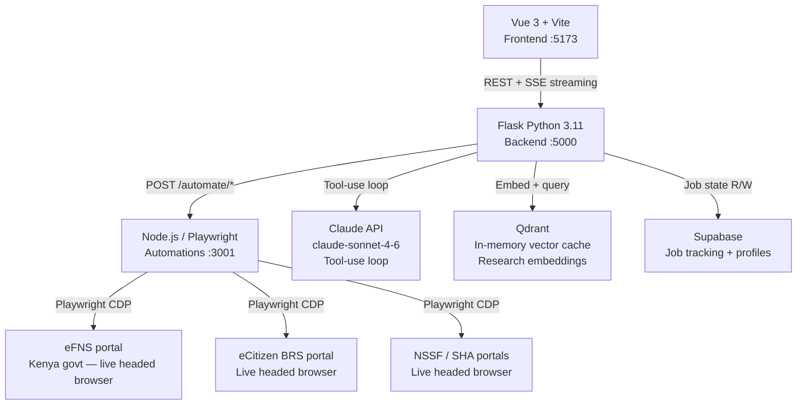
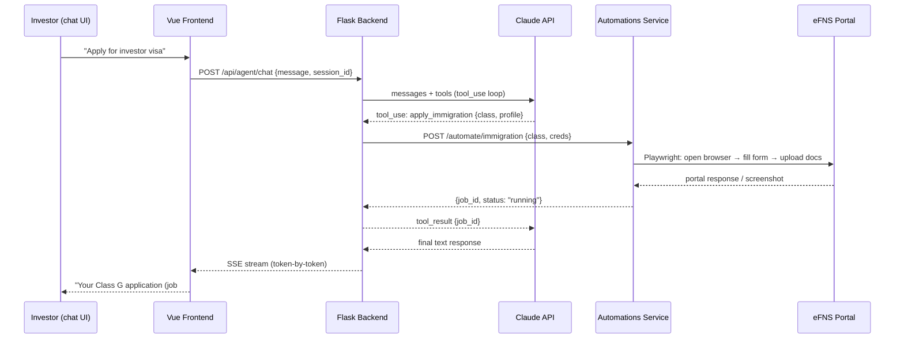

# Meridian Global Investor OS

> **One AI platform to Land, Launch, and Live as a foreign direct investor in Kenya — and beyond - OTHER COUTRIES LATER ON.**

   

Meridian collapses a 6–12-week, multi-portal investor journey into a single AI-orchestrated session. A Claude-powered agentic harness plans the journey; a live Playwright automation layer *executes* it against real government portals — eFNS immigration, eCitizen BRS, NSSF, SHA — on screen, in the browser.

Kenya is the flagship market. Every country is a JSON adapter, so the same OS scales globally.

---

## Table of Contents

- [Investor Journey](#investor-journey)
- [Architecture](#architecture)
- [Agent Sequence](#agent-sequence)
- [Features](#features)
- [Quick Start](#quick-start)
- [Frontend map](#frontend-map)
- [API Reference](#api-reference)
- [One-Click Deploy](#one-click-deploy)
- [Screenshots](#screenshots)
- [Roadmap](#roadmap)
- [Team](#team)
- [License](#license)

---

## Investor Journey


---

## Architecture



---

## Agent Sequence



---

## Features

| Phase | Feature | Status |
|-------|---------|--------|
| **LAND** | Flight search — JFK / LHR / DXB / JNB → NBO / MBA | ✅ Live |
| **LAND** | eTA application — Playwright on Kenya eTA portal | ✅ Live |
| **LAND** | Immigration class advisor — G / D / R / N / SP / eTA | ✅ Live |
| **LAND** | Generated eligibility proposals with itemized fees | ✅ Live |
| **LAND** | Automated eFNS permit filing (headed, stops before submit) | ✅ Live |
| **LAUNCH** | BRS company registration automation | ✅ Live |
| **LAUNCH** | Sector × county licensing roadmap (6 sectors, 47 counties) | ✅ Live |
| **LAUNCH** | NSSF employer registration + Tesseract captcha solving | ✅ Live |
| **LAUNCH** | SHA employer registration automation | ✅ Live |
| **LAUNCH** | KRA PIN registration on iTax (Playwright) — see [docs/KRA.md](docs/KRA.md) | ✅ Live |
| **LAUNCH** | KRA nil-return filing (Playwright) | ✅ Live |
| **LAUNCH** | JD + hiring generator (Kenya-compliant, salary bands) | ✅ Live |
| **LAUNCH** | Human agent marketplace (vetted lawyers / accountants) | ✅ Live |
| **LIVE** | KWS national park concierge (6 parks, KES pricing) | ✅ Live |
| **LIVE** | Booking + emailed invoice (Resend / local HTML fallback) | ✅ Live |
| **CROSS** | Claude agentic harness — 10 tools, prompt caching | ✅ Live |
| **CROSS** | Country-adapter pattern (Kenya = `countries/KE.json`) | ✅ Live |
| **CROSS** | MiroFish-style market-gap researcher + go/no-go verdict | ✅ Live |
| **CROSS** | Shared research cache — Supabase `research_cache`, sha256 query hash, 30d TTL | ✅ Live |
| **CROSS** | Supabase auth (magic-link) + RLS-guarded profiles / notes / documents | ✅ Live |
| **CROSS** | Supabase Realtime — dashboard live-log strip + application status | ✅ Live |
| **CROSS** | Investor profile wizard + personal dashboard | ✅ Live |
| **CROSS** | Job tracking via `automation_jobs` + `job_logs` (RLS + Realtime) | ✅ Live |
| **CROSS** | 100-licence Kenya catalog, sector-tagged, injected into the roadmap | ✅ Live |
| **CROSS** | Licence explorer — industry / category / level / search filters | ✅ Live |
| **CROSS** | Shared public + dashboard layouts, single design-token system | ✅ Live |
| **CROSS** | Demo account with credentials on the login page | ✅ Live |
| **CROSS** | Per-licence statutory fees + durations in the catalog | 🔜 Next |
| **CROSS** | One-click Railway deploy | 🔄 In progress |
| **GLOBAL** | Rwanda / Ghana country adapter | 🔜 Next |
| **GLOBAL** | Realtime voice concierge (VAPI / Kesi) | 🔜 Next |

---

## Quick Start

**Prerequisites**: Python 3.11+, Node.js 18+, an Anthropic API key.

### Step 1 — Clone

```bash
git clone https://github.com/jepale/meridian-investor-platform.git
cd meridian-investor-platform
```

### Step 2 — Configure environment

```bash
cp .env.example .env
# Open .env and set:
#   ANTHROPIC_API_KEY=sk-ant-...
#   NEXT_PUBLIC_SUPABASE_URL=https://<project-ref>.supabase.co
#   VITE_SUPABASE_URL=https://<project-ref>.supabase.co      (browser)
#   VITE_SUPABASE_ANON_KEY=eyJ...                             (browser)
#   SUPABASE_SERVICE_ROLE_KEY=eyJ...                          (server only)
#   RESEND_API_KEY=...        (optional — invoices save locally if absent)
#   EFNS_EMAIL=...            (portal credentials for automation demo)
#   EFNS_PASSWORD=...
```

### Step 3 — Run all three services

```bash
# Terminal 1 — Flask backend + Claude harness
python run_local.py

# Terminal 2 — Node.js Playwright automations microservice
node automations/server.mjs

# Terminal 3 — Vue 3 frontend
cd frontend && npm install && npm run dev
```

Open [http://localhost:3000](http://localhost:3000) and start the investor journey.

### Step 4 — Sign in

Go to `/login`. The demo credentials are printed on the page and filled by one
button:

```
demo@meridian.app / MeridianDemo2026!
```

Seed or reset that account (idempotent — safe to re-run):

```bash
python backend/scripts/seed_demo_user.py
```

Without Supabase credentials the router falls through to guest mode, so the whole app
is still browsable locally.

---

## Frontend map

Full detail in **[docs/UI_ARCHITECTURE.md](docs/UI_ARCHITECTURE.md)**.

Two layouts decide the chrome. Public pages get a hero-aware translucent header and
footer; everything behind the login gets a collapsible sidebar and topbar.

| Route | Page | Layout |
|---|---|---|
| `/` | Landing — replica of the approved static build | Public |
| `/about` · `/pricing` · `/help` | Marketing | Public |
| `/login` | Split-screen auth + demo access | *(own)* |
| `/dashboard` | Market-entry command center | Dashboard |
| `/profile` | 5-step investor profile wizard | Dashboard |
| `/licences` | Licence explorer — 100 licences, filtered by industry | Dashboard |
| `/invest/roadmap` | Roadmap — tree + step-by-step | Dashboard |
| `/applications` · `/documents` · `/experts` · `/concierge` | Journey + support | Dashboard |
| `/invest` · `/invest/graphs` · `/invest/dashboard` | Simulation studio, insights, report | Dashboard |

The public nav is deliberately three links — **About · Pricing · Help**. Everything
else lives behind the login.

**Sector selection** is captured in `ProfileWizard` step 2 and fires trickle-research
in the background the moment sector + county are set; `LicenceExplorer` then
auto-defaults its industry filter to that sector. The animated roadmap construction
lives in `LiveRoadmapBuilder` (`/invest`) and `LoadingOverlay` (`/invest/roadmap`).

Never hardcode a colour — the token system is in `frontend/src/App.vue` and both
light and dark themes must work.

---

## API Reference

All endpoints accept and return JSON. The agent chat endpoint streams via SSE when `Accept: text/event-stream`.

### `POST /api/agent/chat`

Start or continue a conversation with the Claude agentic harness.

```json
// Request
{
  "message": "I want to register a fintech company in Nairobi",
  "session_id": "inv_abc123",   // optional — creates new session if omitted
  "investor_profile": {}        // optional — merged into session state
}

// Response (SSE stream)
data: {"type": "text", "content": "Great — let me build your licensing roadmap..."}
data: {"type": "tool_call", "name": "build_licensing_roadmap", "input": {...}}
data: {"type": "tool_result", "name": "build_licensing_roadmap", "output": {...}}
data: {"type": "done", "session_id": "inv_abc123"}
```

### `POST /api/invest/research`

Run a MiroFish market-gap research query for a given sector and county.

```json
// Request
{ "sector": "agritech", "county": "Nakuru", "depth": "full" }

// Response
{
  "verdict": "GO",
  "confidence": 0.87,
  "gap_summary": "...",
  "market_size_usd": 420000000,
  "key_risks": ["..."],
  "cached": false
}
```

### `POST /api/flights/search`

Search flights into NBO (Nairobi JKIA) or MBA (Mombasa).

```json
// Request
{ "origin": "JFK", "destination": "NBO", "date": "2026-09-15", "type": "one_way" }

// Response
{
  "offers": [
    { "carrier": "Kenya Airways", "stops": 1, "duration_h": 16.5, "price_usd": 720 }
  ],
  "source": "live"   // or "curated"
}
```

### `GET /api/agent/session/:id`

Retrieve session state and tool call history for a given session.

```json
// Response
{
  "session_id": "inv_abc123",
  "investor_profile": { "nationality": "US", "sector": "agritech", "capital_usd": 250000 },
  "phase": "LAUNCH",
  "tool_calls": [...],
  "created_at": "2026-07-25T09:00:00Z"
}
```

### `GET /api/licences`

The sector-tagged Kenya licence catalog. Filters: `sector`, `level`, `category`, `q`.
Passing `sector` returns the universal permits every business needs plus the ones
tagged for that industry, universal-first.

```json
// GET /api/licences?sector=health&level=county
{
  "count": 14,
  "sector": "health",
  "licences": [
    {
      "id": "health-facility-operating-license",
      "no": 46,
      "name": "Health Facility Operating License",
      "category": "Health & Pharma",
      "agency": "Ministry of Health",
      "agency_abbr": "MOH",
      "level": "National/County",
      "applies_to": "Hospitals, clinics, nursing homes",
      "universal": false,
      "sectors": ["health"]
    }
  ]
}
```

Also: `GET /api/licences/meta` → totals, categories, sectors, levels.
`GET /api/licences/<licence_id>` → a single row.

### `POST /api/invest/roadmap`

Builds the 5-phase roadmap. Pass `sector` and the industry-specific licences from the
catalog are injected into Phase 4, deduped against the statutory core already covered
by the static phases.

```json
// Request
{ "sector": "health" }

// Response (abridged)
{
  "phases": [ ... ],
  "summary": {
    "total_days": 91,
    "total_cost_kes": 37150,
    "sector": "health",
    "sector_licences_count": 9,
    "agencies_count": 8,
    "critical_path_nodes": ["BRS_NAME_SEARCH", "BRS_CR1", "KRA_PIN", "COUNTY_BPERMIT"]
  }
}
```

> Sector licence nodes currently carry `cost_kes: 0` / `timeline_days: 21` — the
> catalog has no fee column yet, so the cost total covers the statutory core only.
> See [docs/team/timothy-kipkoech.md](docs/team/timothy-kipkoech.md).

---

## One-Click Deploy

Meridian ships as three Railway services (backend, automations, frontend) with a shared environment.

[](https://railway.app/template/meridian-investor-os)

```bash
# Or deploy manually via the helper script:
bash scripts/deploy_railway.sh
```

The script provisions three Railway services, links them, and prompts for the required environment variables. See `scripts/deploy_railway.sh` for details.

---

## Screenshots

> Add screenshots here — place images in `./assets/screenshots/` and update the paths below.

| View | Screenshot |
|------|------------|
| Concierge chat (landing) |  |
| Immigration class advisor |  |
| Licensing roadmap |  |
| eFNS automation (headed browser) |  |
| Park concierge + invoice |  |
| Investor dashboard |  |

---

## Roadmap

| Item | Status | Notes |
|------|--------|-------|
| Claude agentic harness (10 tools, prompt caching) | ✅ Shipped | claude-sonnet-4-6 |
| Kenya country adapter (immigration + licensing + parks) | ✅ Shipped | `countries/KE.json` |
| 23 automations endpoints (eFNS / BRS / NSSF / SHA) | ✅ Shipped | Playwright, Node.js |
| Flight search (curated + Scrapling live fallback) | ✅ Shipped | Never fails |
| MiroFish researcher + go/no-go verdict | ✅ Shipped | Qdrant cache |
| Apple-polished Concierge chat UI | ✅ Shipped | Vue 3 + spring animations |
| ProfileWizard + InvestorDashboard | 🔄 In progress | Phase 2 UI |
| Supabase persistence (profiles + jobs) | 🔄 In progress | Replaces in-memory store |
| Railway one-click deploy | 🔄 In progress | `scripts/deploy_railway.sh` |
| Rwanda country adapter | 🔜 Next | Second flagship market |
| Ghana country adapter | 🔜 Next | West Africa expansion |
| Realtime voice concierge — Kesi / VAPI | 🔜 Next | Swahili + English |
| Graphiti memory graph (cross-session investor memory) | 🔜 Next | Long-term context |
| AI form-fill review before portal submit | 🔜 Next | Human-in-the-loop gate |
| South Africa adapter | 🌍 Global expansion | |
| Nigeria adapter | 🌍 Global expansion | |
| EU / ASEAN adapters | 🌍 Global expansion | Country adapter contract |

---

## Team

Each collaborator owns a disjoint vertical slice, so nobody edits the same file.
Individual briefs — file ownership, task lists, and conventions — are in
**[docs/team/](docs/team/README.md)**.

| Name | Email | Slice | Brief |
|------|-------|-------|-------|
| **James Epale** | ijepale@gmail.com | Layout, landing, auth, agent harness | *(owner)* |
| **Timothy Kipkoech** | mutaitimo07@gmail.com | Licence catalog + explorer | [brief](docs/team/timothy-kipkoech.md) |
| **Joseph Kerandi** | Kerandijoseph5@gmail.com | Investor dashboard widgets | [brief](docs/team/joseph-kerandi.md) |
| **Millicent Morara** | millicentmorara7@gmail.com | Marketing pages (About / Pricing / Help) | [brief](docs/team/millicent-morara.md) |

---

## License

MIT — see [LICENSE](./LICENSE).

---

> Built for the **Claude Hackathon** · Powered by [Anthropic Claude](https://www.anthropic.com) · A [Claude Community Kenya](https://twitter.com/ClaudeKenyaCom) project
